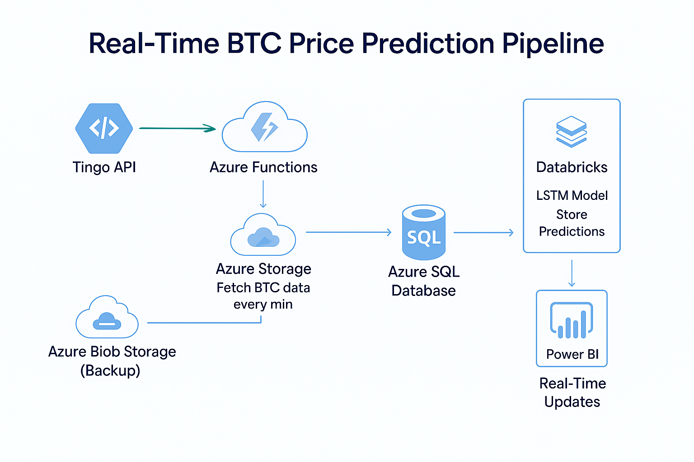
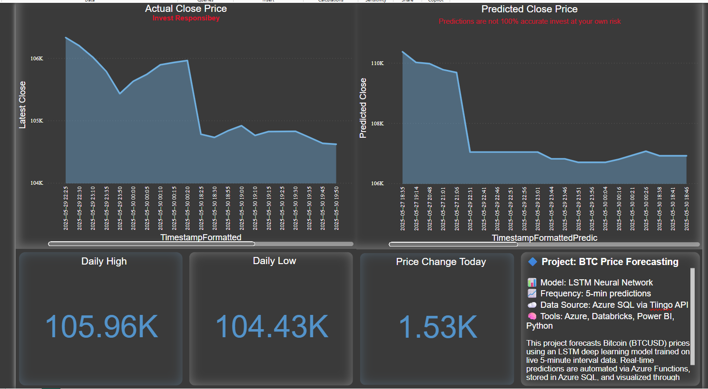

# 🧠 BTC Price Prediction with Real-Time Dashboard

A full-fledged data science and cloud project to forecast Bitcoin (BTC) prices using an LSTM model, stream predictions to an Azure SQL database, and visualize insights on a live Power BI dashboard.

---

## 🚀 Project Overview

This project builds a **real-time pipeline** that:
- Uses an **LSTM (Long Short-Term Memory)** neural network to predict the **next 5-minute close price** of BTC/USD.
- Stores these predictions in an **Azure SQL Database**.
- Archives the latest data in **Azure Blob Storage** as a backup.
- Visualizes both actual and predicted prices on a **Power BI Dashboard** with **live updates** every 5 minutes.

---

## ⚙️ Tech Stack & Tools

| Area                | Tools / Services Used                                  |
|---------------------|--------------------------------------------------------|
| Programming         | `Python`, `Jupyter Notebooks`, `Pandas`, `NumPy`       |
| Machine Learning    | `TensorFlow`, `Keras`, `LSTM Neural Network`           |
| Cloud & Automation  | `Azure SQL Database`, `Azure Blob Storage`, `Azure Functions`, `Databricks` |
| Visualization       | `Power BI` (DirectQuery Mode for live dashboard)       |
| Data Ingestion      | External **Crypto API** using scheduled Azure Function |
| Version Control     | `Git`, `GitHub`                                        |

---

## 📈 Real-Time Pipeline Architecture

Architecture Flow Explanation
This pipeline represents a real-time, cloud-based architecture for predicting Bitcoin (BTC) prices and visualizing them live using Power BI. Here's how the data flows:

📡 1. Tingo API (Data Source)
The process begins with the Tingo API, which serves real-time cryptocurrency market data.

It provides BTC price data including open, high, low, close, and volume at regular intervals.

⚙️ 2. Azure Functions (Data Ingestion)
Azure Functions acts as a serverless job that runs every minute.

It fetches data from the Tingo API and routes it to storage for persistence and processing.

☁️ 3. Azure Storage (Staging + Backup)
The fetched raw BTC data is first written to Azure Storage (Blob Containers) for backup and recovery purposes.

This ensures data isn't lost in case of downstream failures.

💾 4. Azure SQL Database (Structured Storage)
Cleaned or selected parts of the BTC data are inserted into an Azure SQL Database.

This structured storage acts as the main source for analysis and prediction.

🧠 5. Databricks (Prediction Engine)
Databricks is scheduled to run notebooks that:

Read the latest data from Azure SQL.

Preprocess it (scaling, shaping).

Run an LSTM model trained on historical BTC data to predict the closing price for the next interval.

Predictions are written back to the Azure SQL database.

📊 6. Power BI (Visualization)
Power BI is directly connected to the Azure SQL database using DirectQuery.

It auto-refreshes every 5 minutes, displaying:

Real-time BTC close price.

LSTM predictions for the next 5 minutes.

KPIs like max/min/average prices.

Price change trends and volume analytics.

✅ Key Features:
Fully automated and serverless.

Real-time ingestion and prediction loop.

Cloud-native design leveraging:

Azure Functions

Azure Storage & SQL

Databricks

Power BI

Live visualization of both actual and predicted values for monitoring market trends.
---

## 📊 Dashboard Features

- 📉 Line chart of **latest BTC closing prices**
- 🔮 **Predicted BTC close price** every 5 minutes
- 📌 **Max/Min price of the day** KPIs
- 🔁 **Price change tracker**
- 📦 Volume chart for last 3 days
- ⏱ Real-time updates using **Power BI DirectQuery**

---

